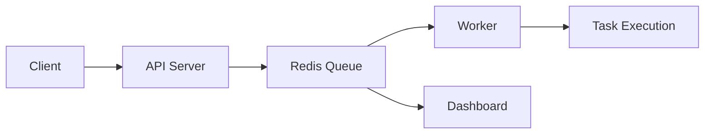

# Email Queue System
A backend system that uses the Bull library and Redis to asynchronously process emails. This system supports background processing by workers, simulates job failures and allows retries.
It includes a monitoring dashboard using Bull Board and is containerized with Docker.


## Overview
Many modern applications require asynchronous task management to handle operations like sending emails or processing e-commerce orders.
Executing these tasks shouldn't hinder regular user activities and should be processed in the backgroung to prevent latency increase and degrading user experience.
This project demonstrates how to offload such tasks to background workers using a job queue.
By decoupling task execution from the request lifecycle, the system achieves better performance, scalability, and fault tolerance.


## Architecture
- API (Producer): Receives requests and adds jobs to the queue
- Redis: Stores and manages the job queue
- Worder (Consumer): Processes jobs asynchronously

Flow:
Client -> API -> Redis Queue -> Worker -> Task Execution


## Features
- Asynchronous job processing
- Failure simulation and retry handling
- Delayed job execution
- Dockerized services (API, worker, Redis)
- Queue visualization via Bull Board


## Getting Started
### Prerequisites
- Docker installed
 
  ### Run the project
```bash
docker compose up --build
```


## API Request
Api will be available at: https://localhost:3000

### Send email
POST /send-email

Body: 
```json
{
  "to": "janedoe@gmail.com",
  "subject": "Hello World",
  "body": "This is a test email."
}
```

## Monitoring Jobs
Access Bull Board dashboard at:
http://localhost:3000/admin/queues


## Key Learnings
- Designed a producer-consumer architecture using Redis
- Implemented retry logic and failure handling
- Used Docker Compose to orchestrate multiple services


## Future Improvements
- Add real email sending (SMTP)
- Migrate to BullMQ for more scalable architecture
